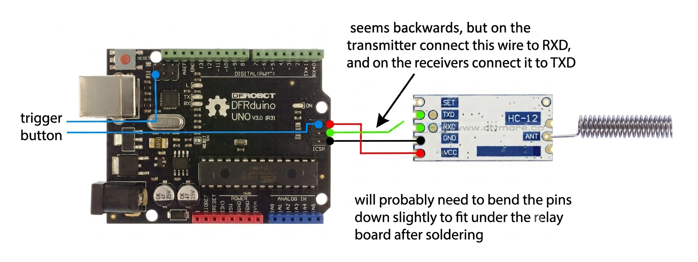

## Setup

- Upload `receiver.ino` to all the receivers with Arduino IDE
- Upload `transmitter.ino` to the transmitter
- Only the transmitter needs the trigger button
- All boards should still have a power button or be plugged in just before exit
